# Architecture

The whole application is one Rust crate compiled to WebAssembly. Everything
below `app` and `ui` is plain Rust with no browser dependency, so the same code
runs headless in the smoke binaries and the tests; only the two top layers touch
the DOM, and they are compiled out entirely on a native target.

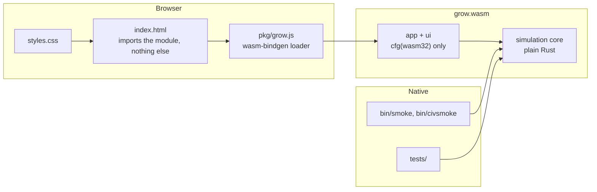

## Module map

The project has two halves that share one state: the plant lab authors species
and materials, and the settlement runs a world made of them.

```mermaid
flowchart TD
  subgraph shell [Shell]
    main["app.rs<br/>modes, tabs, frame loop, project IO"]
    state["state.rs<br/>project state, save/load"]
  end

  subgraph labpanels [Lab panels]
    matp["ui/materials_panel.rs"]
    shdp["ui/shading_panel.rs"]
    spp["ui/species_panel.rs"]
    wldp["ui/world_panel.rs"]
    ge["ui/grid_editor.rs<br/>drawable pixel grid"]
    ctl["ui/mod.rs<br/>schema driven fields"]
  end

  subgraph civpanels [Settlement panels]
    lndp["ui/land_panel.rs"]
    pplp["ui/people_panel.rs"]
    bldp["ui/build_panel.rs"]
    ecop["ui/economy_panel.rs"]
    tchp["ui/tech_panel.rs"]
  end

  subgraph core [Simulation core, no browser]
    sim["sim.rs<br/>spawn, schedule, composite"]
    world["world.rs<br/>cell grid, layer occupancy"]
    plant["plant.rs<br/>growth, raster, shade"]
    species["species.rs<br/>definitions, schema, limits"]
    sampler["sampler.rs<br/>sampling boxes, ramps"]
    shading["shading.rs<br/>tone curve"]
    rng["rng.rs"]
    util["util.rs<br/>color, distance transform, labels"]
  end

  subgraph civ [Settlement, no browser]
    sett["civ/settlement.rs<br/>map, buildings, towns"]
    colony["civ/colony.rs<br/>one town's books"]
    tasks["civ/tasks.rs<br/>what a settler does next"]
    planner["civ/planner.rs<br/>what to build and where"]
    terrain["civ/terrain.rs<br/>noise, rivers, deposits"]
    people["civ/people.rs<br/>record, needs, movement"]
    pdb["civ/people_db.rs<br/>the register of settlers"]
    social["civ/social.rs<br/>who has met whom, and what they made of it"]
    boats["civ/boats.rs<br/>hulls, cargoes, voyages"]
    path["civ/pathing.rs<br/>A* over land and water"]
    econ["civ/economy.rs<br/>prices, wages, caravans"]
    tech["civ/tech.rs<br/>unlocks and modifiers"]
    bdefs["civ/buildings.rs<br/>catalog and recipes"]
    res["civ/resources.rs"]
    cfg["civ/config.rs<br/>every parameter"]
    names["civ/names.rs"]
  end

  render["render.rs<br/>camera, overlays, previews"]
  civrender["civ/civ_render.rs<br/>terrain, buildings, settlers"]

  main --> state
  main --> sim
  main --> sett
  main --> render
  main --> labpanels
  main --> civpanels
  state --> cfg
  matp --> ge
  labpanels --> ctl
  civpanels --> ctl
  matp --> sampler
  shdp --> shading
  spp --> species
  wldp --> world
  lndp --> terrain
  pplp --> people
  bldp --> bdefs
  ecop --> econ
  tchp --> tech
  sim --> world
  sim --> plant
  sim --> species
  sim --> sampler
  plant --> shading
  plant --> sampler
  plant --> util
  sampler --> util
  render --> world
  sett --> sim
  sett --> terrain
  sett --> tasks
  sett --> planner
  sett --> colony
  sett --> pdb
  sett --> social
  social --> people
  sett --> boats
  sett --> path
  sett --> bdefs
  sett --> res
  sett --> civrender
  colony --> econ
  colony --> tech
  pdb --> people
  boats --> path
  boats --> colony
  tasks --> people
  tasks --> res
  planner --> bdefs
  civrender --> sampler
```

## One map, several towns

The world is one terrain with one wilderness growing on it. A *colony* is a set
of books over that shared map: its own store, treasury, prices and research.
Buildings and people carry the id of the town they belong to, and every question
about stock, wages or what is worth building is asked of that colony rather than
of the map.

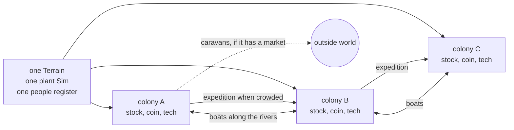

A crowded, well stocked colony sends a party of its most restless adults, and
the families that follow them, to a site far enough from every other town to be
its own place. They carry founding supplies and a quarter of the treasury out of
the parent's store, and everything the parent had learned. From then on the two
diverge: they research separately, they run out of different things, and that is
what gives the boats something to carry.

## Data model

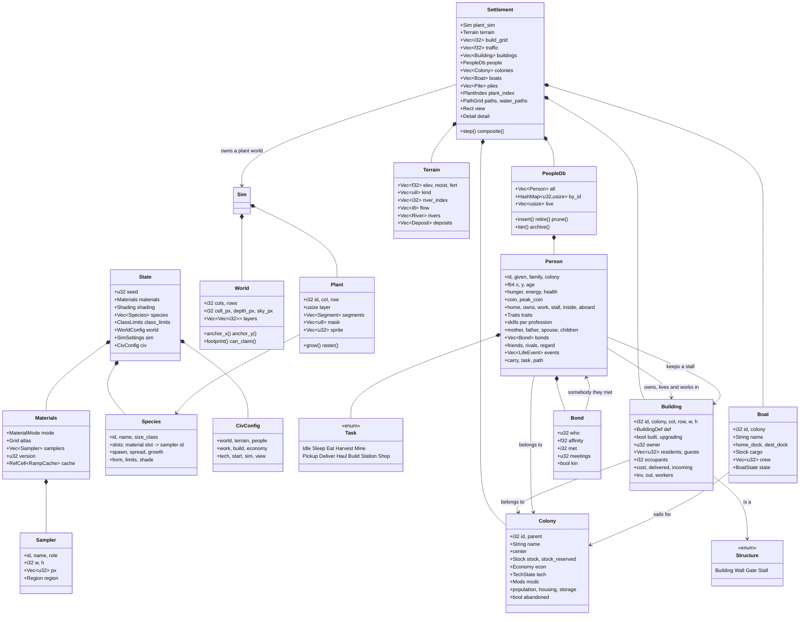

## The register of settlers

Everyone who has ever lived keeps a slot. Slots are stable, so an index handed
to a task this tick still means the same person next tick, and looking somebody
up by id is a hash rather than a scan of the whole population. The dead are
marked, not removed, which is what makes parentage, marriages and obituaries
answerable questions rather than strings copied out before the record was
dropped.

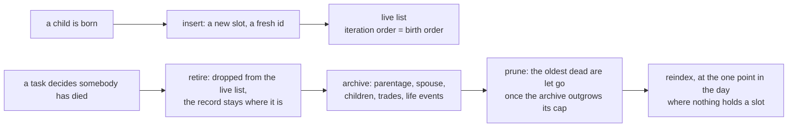

`retire` returning false, rather than the `alive` flag, is what decides whether
a death is counted: a task sets that flag the moment it decides somebody has
died and the burial happens afterwards, so the flag alone would count the same
death on every tick for the rest of the run.

## Frame pipeline

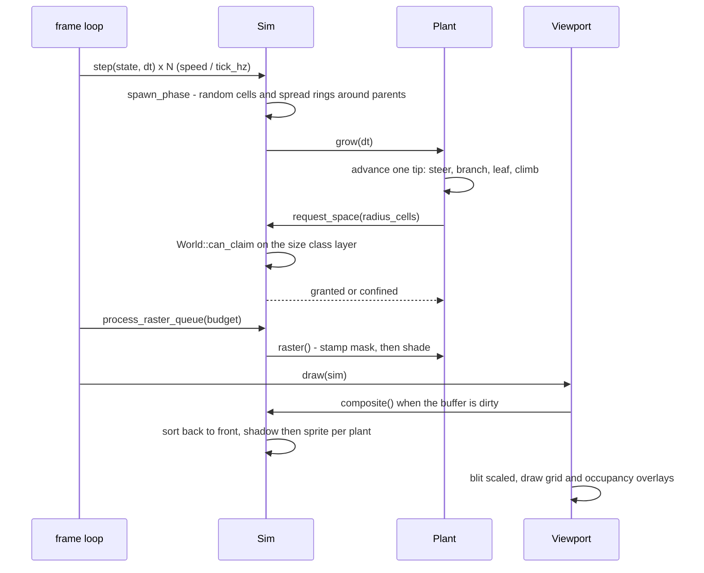

## Shading pass

Each plant pixel is shaded from two measurements taken inside its own shape,
not inside the whole plant:


The curve `C` is a smoothstep between `edge0` and `edge1` raised to `gamma`.
Narrowing the gap between the two edges widens the flat plateau, which is what
keeps the body of an object on one tone and confines the shading to a rim.

## Projection

The grid is a ground plane seen at an angle. A cell is `cellPx` wide and
`depthPx` tall on screen, so depth is foreshortened; plants stand up out of
their cell into the sky band above the far row, and are composited back to
front.


## Rivers

Rivers are cut after the noise rather than sampled out of it, because a river
has to be a *path*: something a boat can follow from one town to another. A
spring is picked in the high ground, the course is traced downhill by steepest
descent with a remembered heading, and only then is the channel cut.

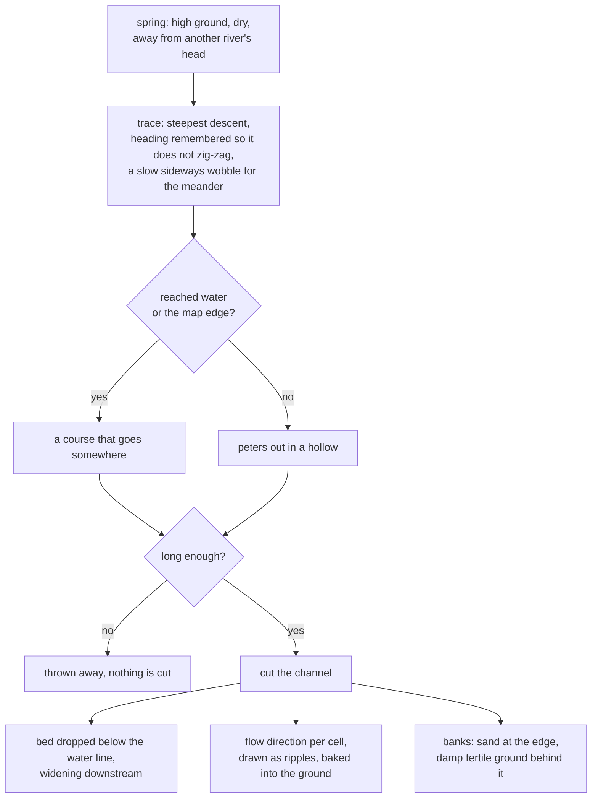

The course is kept as the polyline it was cut along, so a river has a name, a
length and an answer to whether it reaches the sea. Cells carry which river they
belong to, which is what tells a jetty site on running water from one on a pond.

## Occupancy rules

One grid cell can hold one item per size class layer, so a ground cover and a
tree coexist while two trees cannot. A plant claims a disc of cells around its
own cell and asks the sim to enlarge it as it grows; a refused request marks
the plant confined and steers its tips back inward. Height is free, only the
ground footprint is contested.

A building's footprint is claimed on a second grid, and that grid is what the
pathfinder reads. A gate is the one thing that claims a cell and still lets
people cross it, so it gets a grid of its own: the passability test runs once
per neighbor per expanded cell and cannot afford a building lookup to answer it.

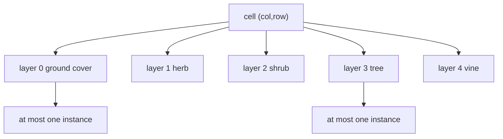

## Settlement tick

The settlement owns a plant world of its own and runs it first, so the
wilderness keeps growing while people work in it.

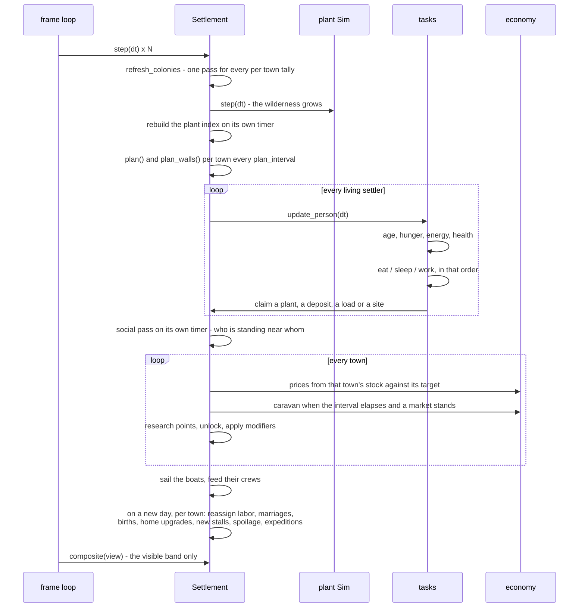

## What a settler does

Every task is walk, work, carry. Nothing enters the store that a person did not
carry there.

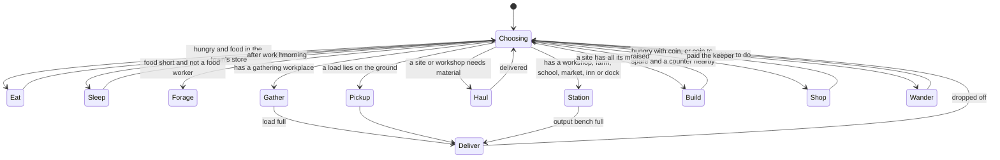

Sleeping is where a settler goes indoors, which is also the only place the map
loses sight of somebody:

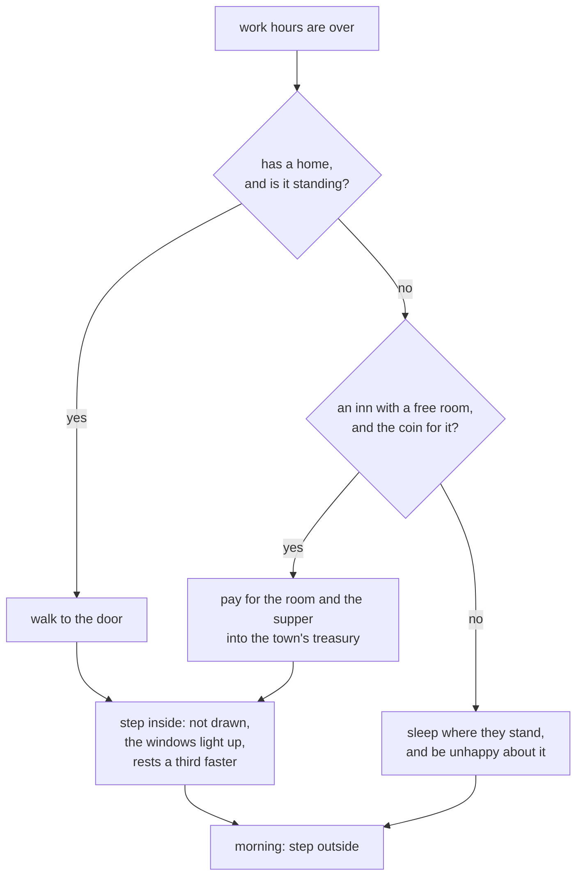

## The ladder of homes

A settler who has saved enough has their own house pulled down and rebuilt one
rung larger. Nobody plans this and no town decides it: it is one person's coin
and one person's decision, and the tower at the end of it is the mark of a
fortune rather than of a plan.

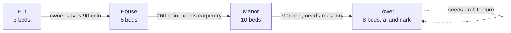

```mermaid
sequenceDiagram
  participant O as the owner
  participant T as the treasury
  participant B as the house
  participant L as laborers
  participant I as the inn

  O->>T: pays the price of the rebuild
  Note over B: def swapped for the next rung,<br/>footprint grown into its own yard,<br/>old walls salvaged into the site
  B->>O: the household loses its beds
  O->>I: takes a room, or sleeps rough
  T->>L: wages
  L->>B: carry the brick, raise the walls
  B->>O: finished; the deed was never given up
```

Wages only move once a town has a market, so a village of huts stays a village
of huts until it has one. What a settler keeps of a wage rather than spending it
back into the town the same day is the single number that decides how fast
anybody gets rich.

Rebuilds are rationed. A house on the ground is beds out of the housing stock
and a household with nowhere to sleep, so a town raises one at a time and only
starts when there is a spare bed or a free inn room for the people it displaces.

## Households

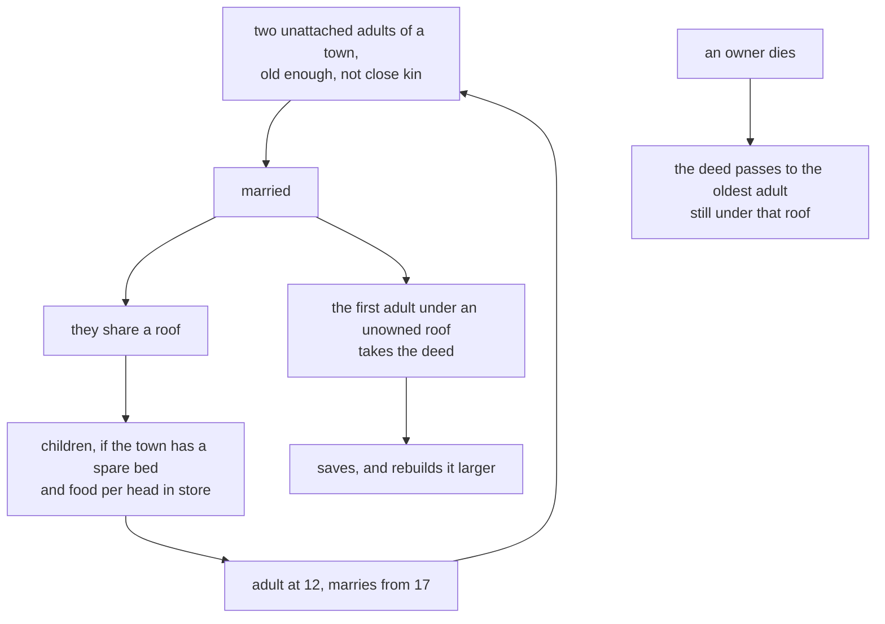

Two details here are load bearing rather than decorative. Births are spread over
the town's couples rather than always credited to the first, or every child in
the town shares a mother and the whole next generation are siblings who cannot
marry each other. And a couple's fertility is a property of the pair - the
younger age decides, and either partner having a roof is enough - or a household
whose house is scaffolding stops having children for the duration.

## Walls and the way through

A town that has learned to fortify rings itself. The ring is a rectangle around
everything the town has built - not around its outlying camps, and not around
the wall itself, or it would push itself one cell further out on every pass and
never close.

Gates are drawn to the busiest cells of the ring and wall to the quietest, so
the ways through end up on the roads people have already worn and the blank
stretches go over ground nobody crosses.

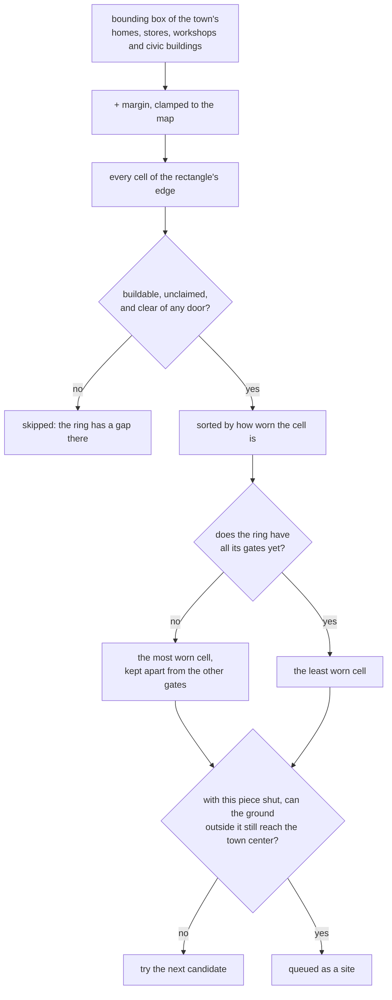

That last test is the whole safety rule, and it is what makes the ring
self-limiting: a piece is only ever queued if the outside can still get in
without it. A gate is passable once it is standing, so the moment one is
finished the stretches beside it are free to be closed; with no gate at all,
the last gap simply never gets filled. Nothing has to know how many holes the
ring has.

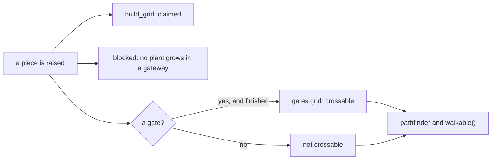

Wall pieces have a site budget of their own, separate from the planner's, or a
town that decided to ring itself would stop building anything else until the
ring was closed. A ring is also the work of a town rather than of a village: a
settlement that walls itself too early spends everything it owns on the wall
and then starves inside it, so there is a head count below which nobody starts.

## Counters

A stall is one settler's business. Nobody plans one and nobody is assigned to
keep one: a settler with coin to spare buys the counter themselves, and the
person who paid for it is the person who stands behind it.

```mermaid
sequenceDiagram
  participant K as the keeper
  participant T as the treasury
  participant S as the town store
  participant C as the counter
  participant B as a passer-by

  K->>T: pays for the stall out of their own purse
  T->>K: laborers raise it; the deed is the keeper's
  loop while the counter is thin
    K->>S: walks over, buys what the town has spare
    K->>T: at the town's price, out of their own purse
    K->>C: carries it back and puts it out
  end
  B->>C: hungry with coin, or coin to spare
  B->>K: pays the town price plus the keeper's margin
  C->>B: a meal, or something bought for its own sake
```

This is the only thing in the settlement that moves coin from one person to
another without the treasury in the middle, and it is the only use a settler
has for coin besides a roof and a meal. The margin is what a practised trader
gets away with, so keeping a stall is a trade somebody gets better at.

Only what the town has spare is ever bought for a counter: a keeper who cleared
the granary in a famine would be selling the town its own last meal back to it.
A counter whose keeper dies stays standing with nobody behind it, which is what
lets the next settler with the coin take it on rather than pay for another one.

## What people make of each other

Everyone a settler has stood near for long enough keeps a slot in that
settler's memory: when they met, how often since, and what the two of them have
come to think of one another. Both sides get their own record, written at the
same moment.

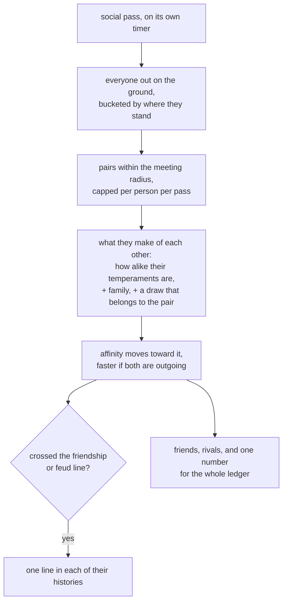

The pass is bucketed and capped rather than pairwise, so a market square with
forty people in it costs forty times a small constant instead of sixteen
hundred. It draws no random numbers at all - the per pair draw is a hash of the
two ids - so it is reproducible and does not perturb the order of every other
decision in the sim.

What the bonds are actually for:

```mermaid
flowchart LR
  bond["affinity"] --> marry["who somebody marries,<br/>among people of a like age"]
  bond --> buy["whose counter they walk to"]
  bond --> mood["contentment: friends nearby<br/>against rivals"]
  bond --> stand["standing in the town"]
  kin["family bonds"] --> keep["never forgotten to<br/>make room for a stranger"]
```

Memory is capped, and the cap is a cap on people somebody merely met: the
faintest of those is dropped to make room, and a memory that is nothing but
family has no room for a stranger at all.

One detail here is load bearing rather than decorative, and it took two
demographic collapses to find. Affinity decides *between* plausible matches,
and its say falls away as two ages diverge. Weighing it against the age gap
instead - which is the obvious way to write it - marries a strong friendship
across a generation, that couple is past bearing within a few years, and a town
that ages fast enough stops having children altogether. Nothing in the
bookkeeping notices, because nothing about it is inconsistent.

The same shape of mistake sits behind how the affinity itself is computed.
Sociability already gates whether somebody looks for a spouse at all; letting
it also raise affinity with everyone turns it into a single hidden score for
how likeable a person is, and a town whose affinities favor the outgoing
marries its sociable half to itself and leaves the rest single. Each trait is
read by one part of the sim, and this is why.

## Material flow

Raw materials come out of the ground or off a plant, are carried to a store,
and are carried out again to whatever consumes them. Every arrow is somebody
walking.

```mermaid
flowchart LR
  trees["trees and shrubs"] -->|woodcutter fells| wood[wood]
  mats["ground cover<br/>cut back, regrows"] -->|forager| food[food]
  mats --> fiber[fiber]
  fields["fertile ground"] -->|farm| food
  stoneDep["stone deposit"] -->|quarry| stone[stone]
  clayDep["clay deposit"] -->|clay pit| clay[clay]
  oreDep["ore deposit"] -->|mine| ore[ore]

  wood -->|sawpit| plank[plank]
  wood -->|charcoal hearth| charcoal[charcoal]
  clay --> kiln[[kiln]]
  charcoal --> kiln
  kiln --> brick[brick]
  ore --> smelter[[smelter]]
  charcoal --> smelter
  smelter --> metal[metal]
  metal --> smithy[[smithy]]
  charcoal --> smithy
  smithy --> tool[tool]
  fiber -->|weaver| cloth[cloth]

  plank --> builds["houses, granary, school, market,<br/>inn, dock"]
  brick --> builds
  stone --> builds
  tool --> builds
  cloth --> builds
  food --> people["settlers eat, and are born"]
  food --> inn["inn: a supper with the room"]
  plank --> hull["dock: hulls"]
  wood --> hull
  hull --> boats["boats, and the trade between towns"]
```

## Boats and the water between towns

A river is only a feature until something uses it. A colony with a dock lays
down hulls there, crews them from the dock workers, and sends them to the towns
that want what it has too much of. Boats path over water cells only, so a town
on a lake trades with nobody and a town on a river that reaches the sea trades
with everyone.

```mermaid
stateDiagram-v2
  [*] --> Moored
  Moored --> Moored: nothing worth casting off for
  Moored --> Outbound: loaded with the surplus,<br/>crew aboard, a port chosen
  Outbound --> Trading: tied up at the far jetty
  Trading --> Inbound: sold the cargo at their prices,<br/>bought what home is short of
  Inbound --> Moored: landed, coin into the treasury,<br/>crew ashore
  Trading --> Moored: the way home has silted up
```

The far town's prices are the far town's, not ours, which is the whole point:
the boat sells into a shortage and buys out of a glut, and doing that repeatedly
levels two towns without either of them deciding to. Crews are not simulated
while aboard; the boat carries food for them and feeds them at sea.

```mermaid
flowchart LR
  a["colony A<br/>too much timber"] -->|load| boat(("boat"))
  boat -->|water path only| b["colony B<br/>short of timber, has ore"]
  b -->|sells at B's price| coin["coin in the hold"]
  coin -->|buys B's surplus| boat2(("boat"))
  boat2 -->|home| a
```

## Loads on the ground

A person carries one load. Anything a felled tree yields beyond that stays
where it fell until somebody comes back for it, and rots if nobody does. The
same happens to a delivery the store has no room for, which is what makes the
next storehouse worth building.

```mermaid
flowchart TD
  cut["plant felled or dug"] --> split{"fits in one load?"}
  split -->|yes| carry["carried to the store"]
  split -->|no| pile["pile left on the ground"]
  pile --> claim["a free pair of hands claims it"]
  claim --> carry
  pile --> rot["rots over pile_life days"]
  carry --> full{"store has room<br/>and wants it?"}
  full -->|yes| stock["stock"]
  full -->|no| pile
```

## Settlement drawing

Nothing about a building or a settler is stored as art: both are generated from
their own numbers and the sampling boxes, and cached by the values they were
built from.

```mermaid
flowchart TD
  terrain["terrain type per cell"] --> ground["ground layer<br/>sky, water, soil, grass, rock"]
  traffic["traffic per cell"] --> ground
  shadows["contact shadows of<br/>plants and buildings"] --> ground
  ground --> cache["cached until a plant grows,<br/>a building goes up or the palette changes"]
  cache --> frame["frame buffer"]
  order["sort by row, then flat before standing,<br/>then piles, buildings, people"] --> frame
  bdef["building w, h, wall and roof height<br/>in cell widths"] --> bsprite["roof plane over the footprint depth,<br/>front wall on the near edge,<br/>door and windows spaced along it"]
  ramps["sampling box ramps<br/>timber, thatch, stone, brick, cloth"] --> bsprite
  bsprite --> frame
  pseed["person id hash"] --> psprite["skin, shirt, hair<br/>two frame walk cycle"]
  psprite --> frame
  frame --> night["night tint and labels<br/>drawn on the canvas, not the buffer"]
```

## Drawing a map too big to draw

A map worth having is a map most of which is off screen and the rest of which is
too small to read. Two things keep the cost of a frame tied to the size of the
window rather than the size of the map.

**Only the visible band is touched.** The camera hands the settlement the
rectangle of world pixels it can show. That band, and only that band, is copied
out of the cached ground, composited into, and uploaded to the canvas. The rest
of the buffer stays stale, because nothing is going to look at it.

**Detail is shed in stages as the camera pulls back.**

```mermaid
flowchart TD
  zoom["camera zoom"] --> lvl{"against the detail threshold"}
  lvl -->|at or above| full["full: everything"]
  lvl -->|above half| red["reduced: no smoke, no carried loads,<br/>no lit windows, no door openings,<br/>no contact shadows"]
  lvl -->|above a quarter| coarse["coarse: plants become one dab of their<br/>own average color, people become<br/>two pixels, piles are dropped"]
  lvl -->|below| blocks["blocks: buildings are filled roof<br/>rectangles, people one pixel,<br/>plants a two pixel dab"]
```

A plant's average color is measured once, at raster time, over a stride of its
finished sprite; drawing a forest of thousands at the furthest zoom is then one
write per plant. Town names are drawn over their centers at every zoom, because
at the zoom where several towns fit on screen they are the only thing telling
them apart.

## Finding a way

Pathing is A* over the same eight neighbors, with three things that make it
survive a hundred thousand cells: visited marks are generation stamped rather
than cleared, the frontier is a heap ordered by an octile heuristic so a search
reaches the goal instead of fanning out over the map, and every search is capped
so an unreachable target costs a bounded amount. Cells that have been walked
over are cheaper to cross, which is why traffic wears into roads that people
then prefer.

The same grid, with water as the passable set instead of land, is what the boats
use.

## Asking what is growing nearby

Every gathering decision used to walk the whole plant list. Instead a coarse
bucket grid holds a flat copy of the one thing the settlement asks about -- how
much of what, and where -- rebuilt on a timer rather than kept exact, because a
camp choosing a tree that grew a little since the last sweep is invisible.

```mermaid
flowchart LR
  plants["every plant"] -->|on a timer| marks["PlantMark: id, cell,<br/>mass, size class, who claimed it"]
  marks --> buckets["buckets of 8x8 cells"]
  buckets --> pick["pick a tree: read the buckets<br/>within reach, not the map"]
  buckets --> camp["site a camp: standing biomass<br/>near a candidate cell"]
  buckets --> staff["staff a camp: is there<br/>anything left to cut?"]
```

A task that comes back to the same plant every tick carries the slot it last
found it in, so the lookup is a bounds check rather than a scan, and the scan is
only paid for on the ticks where something was actually removed.

## Counting things once

The same shape of mistake keeps appearing: a question that reads like a field
access but is a fold over the whole world, asked inside a loop.

```mermaid
flowchart LR
  q["how many of these do we have?<br/>is there a market?<br/>how many beds?"]
  q --> bad["once per caller<br/>= a walk of every building"]
  q --> good["once per pass<br/>= a lookup"]
  good --> a["refresh_colonies:<br/>population, adults, roofless,<br/>housing, storage, market, stores"]
  good --> b["tally_types:<br/>per building type, how many stand<br/>and how many benches are empty"]
```

`has_market`, asked per working settler per tick, was a walk of every building
in the world. `plan_next` asked three such questions for each of twenty-five
building types, twice a simulated second per colony. Both are now one pass whose
result everything else reads.
