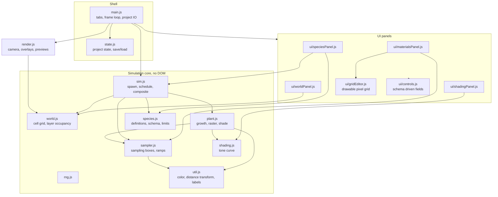
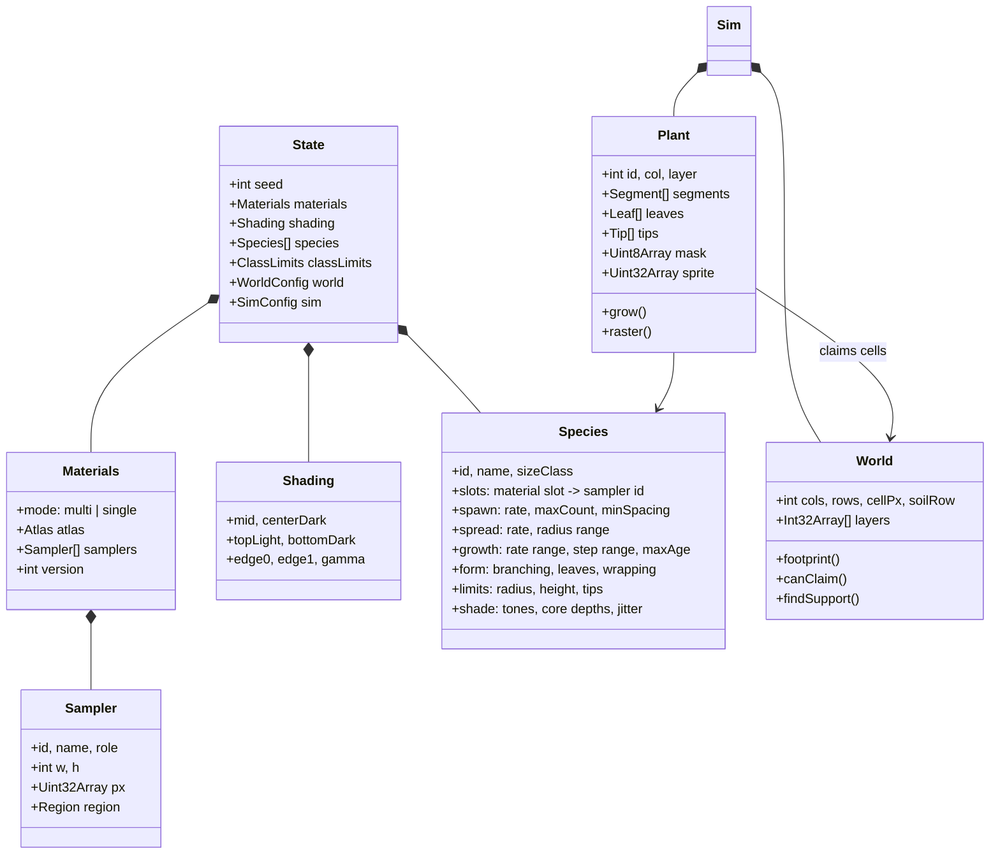
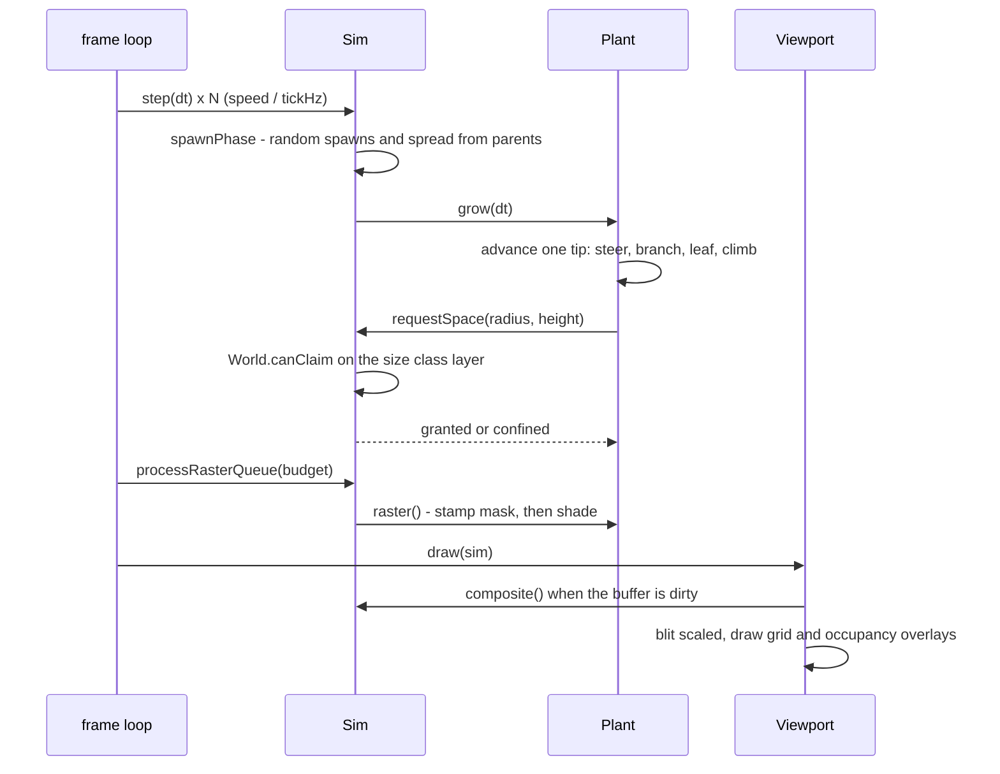
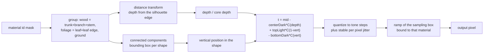
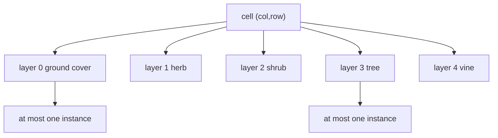

# Architecture

## Module map

## Data model

## Frame pipeline

## Shading pass

Each plant pixel is shaded from two measurements taken inside its own shape,
not inside the whole plant:

The curve `C` is a smoothstep between `edge0` and `edge1` raised to `gamma`.
Narrowing the gap between the two edges widens the flat plateau, which is what
keeps the body of an object on one tone and confines the shading to a rim.

## Occupancy rules

One grid cell can hold one item per size class layer, so a ground cover and a
tree coexist while two trees cannot. A plant claims a rectangle of cells
(footprint radius by height) and asks the sim to enlarge it as it grows; a
refused request marks the plant confined and steers its tips back inward.

