# Architecture

## Module map

The project has two halves that share one state: the plant lab authors species
and materials, and the settlement runs a world made of them.

```mermaid
flowchart TD
  subgraph shell [Shell]
    main["main.js<br/>modes, tabs, frame loop, project IO"]
    state["state.js<br/>project state, save/load"]
  end

  subgraph labpanels [Lab panels]
    matp["ui/materialsPanel.js"]
    shdp["ui/shadingPanel.js"]
    spp["ui/speciesPanel.js"]
    wldp["ui/worldPanel.js"]
    ge["ui/gridEditor.js<br/>drawable pixel grid"]
    ctl["ui/controls.js<br/>schema driven fields"]
  end

  subgraph civpanels [Settlement panels]
    lndp["ui/landPanel.js"]
    pplp["ui/peoplePanel.js"]
    bldp["ui/buildPanel.js"]
    ecop["ui/economyPanel.js"]
    tchp["ui/techPanel.js"]
  end

  subgraph core [Simulation core, no DOM]
    sim["sim.js<br/>spawn, schedule, composite"]
    world["world.js<br/>cell grid, layer occupancy"]
    plant["plant.js<br/>growth, raster, shade"]
    species["species.js<br/>definitions, schema, limits"]
    sampler["sampler.js<br/>sampling boxes, ramps"]
    shading["shading.js<br/>tone curve"]
    rng["rng.js"]
    util["util.js<br/>color, distance transform, labels"]
  end

  subgraph civ [Settlement, no DOM]
    sett["civ/settlement.js<br/>world, buildings, books"]
    tasks["civ/tasks.js<br/>what a settler does next"]
    planner["civ/planner.js<br/>what to build and where"]
    terrain["civ/terrain.js<br/>noise, deposits, fertility"]
    people["civ/people.js<br/>needs, movement"]
    econ["civ/economy.js<br/>prices, wages, caravans"]
    tech["civ/tech.js<br/>unlocks and modifiers"]
    bdefs["civ/buildings.js<br/>catalog and recipes"]
    res["civ/resources.js"]
    cfg["civ/config.js<br/>every parameter"]
    names["civ/names.js"]
  end

  render["render.js<br/>camera, overlays, previews"]
  civrender["civ/civRender.js<br/>terrain, buildings, settlers"]

  main --> state
  main --> sim
  main --> sett
  main --> render
  main --> labpanels
  main --> civpanels
  state --> cfg
  matp --> ge
  labpanels --> ctl
  civpanels --> ctl
  matp --> sampler
  shdp --> shading
  spp --> species
  wldp --> world
  lndp --> terrain
  pplp --> people
  bldp --> bdefs
  ecop --> econ
  tchp --> tech
  sim --> world
  sim --> plant
  sim --> species
  sim --> sampler
  plant --> shading
  plant --> sampler
  plant --> util
  sampler --> util
  render --> world
  sett --> sim
  sett --> terrain
  sett --> tasks
  sett --> planner
  sett --> people
  sett --> econ
  sett --> tech
  sett --> bdefs
  sett --> res
  sett --> civrender
  tasks --> people
  tasks --> res
  planner --> bdefs
  civrender --> sampler
```

## Data model

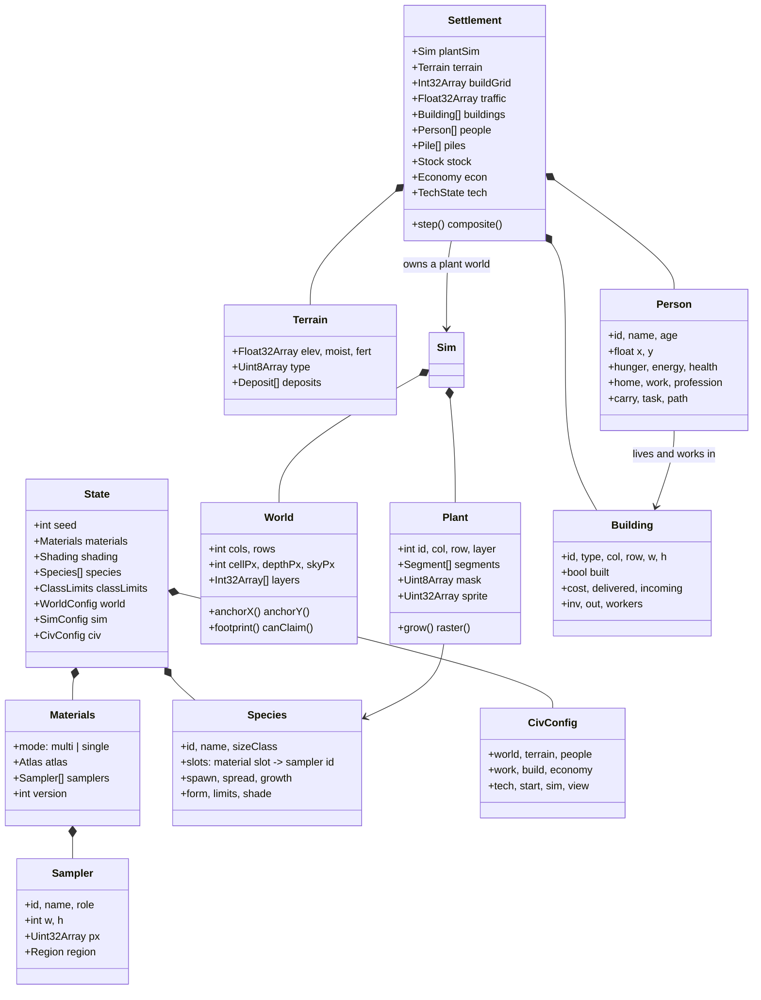

## Frame pipeline

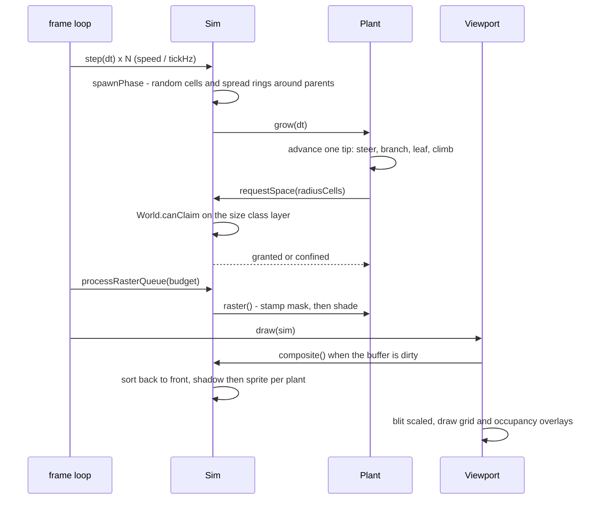

## Shading pass

Each plant pixel is shaded from two measurements taken inside its own shape,
not inside the whole plant:

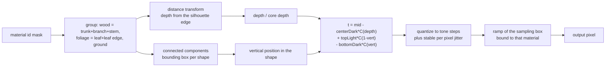

The curve `C` is a smoothstep between `edge0` and `edge1` raised to `gamma`.
Narrowing the gap between the two edges widens the flat plateau, which is what
keeps the body of an object on one tone and confines the shading to a rim.

## Projection

The grid is a ground plane seen at an angle. A cell is `cellPx` wide and
`depthPx` tall on screen, so depth is foreshortened; plants stand up out of
their cell into the sky band above the far row, and are composited back to
front.

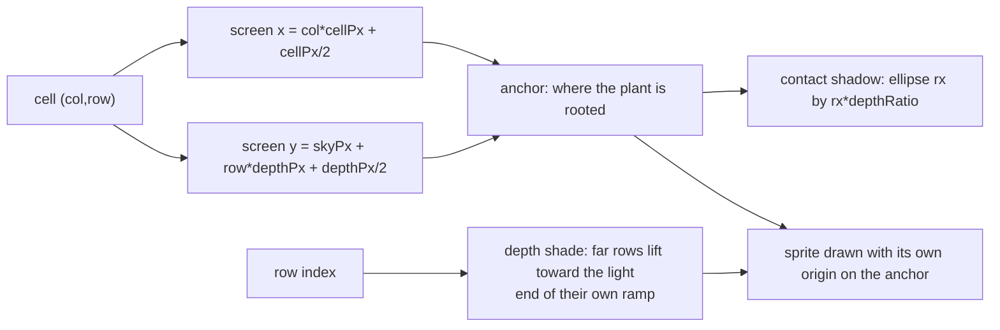

## Occupancy rules

One grid cell can hold one item per size class layer, so a ground cover and a
tree coexist while two trees cannot. A plant claims a disc of cells around its
own cell and asks the sim to enlarge it as it grows; a refused request marks
the plant confined and steers its tips back inward. Height is free, only the
ground footprint is contested.

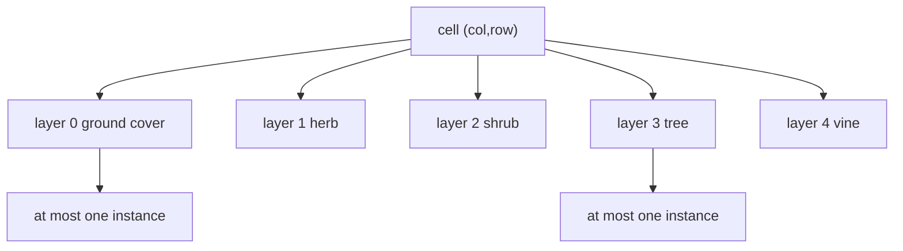

## Settlement tick

The settlement owns a plant world of its own and runs it first, so the
wilderness keeps growing while people work in it.

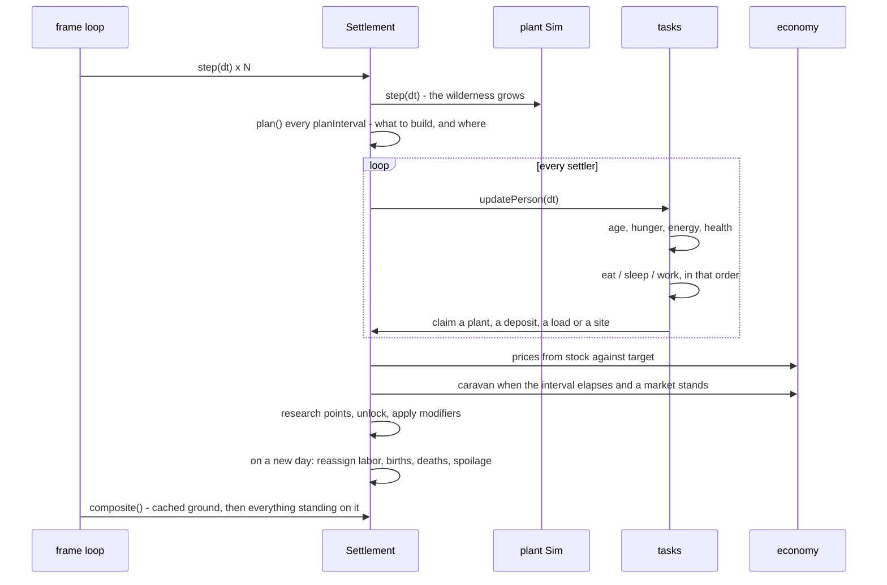

## What a settler does

Every task is walk, work, carry. Nothing enters the store that a person did not
carry there.

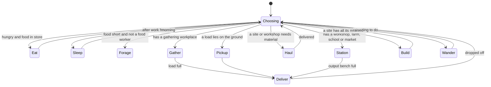

## Material flow

Raw materials come out of the ground or off a plant, are carried to a store,
and are carried out again to whatever consumes them. Every arrow is somebody
walking.

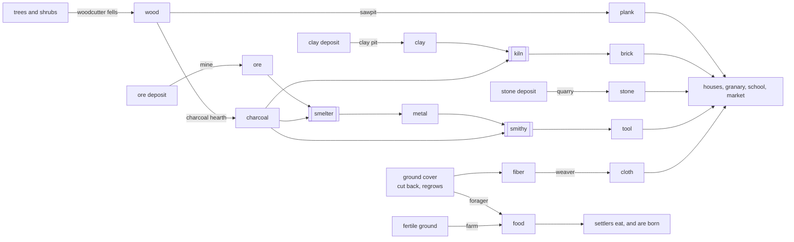

## Loads on the ground

A person carries one load. Anything a felled tree yields beyond that stays
where it fell until somebody comes back for it, and rots if nobody does. The
same happens to a delivery the store has no room for, which is what makes the
next storehouse worth building.

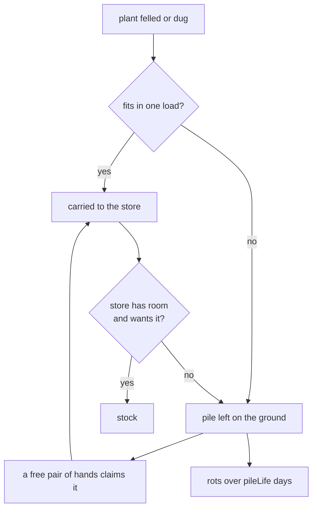

## Settlement drawing

Nothing about a building or a settler is stored as art: both are generated from
their own numbers and the sampling boxes, and cached by the values they were
built from.

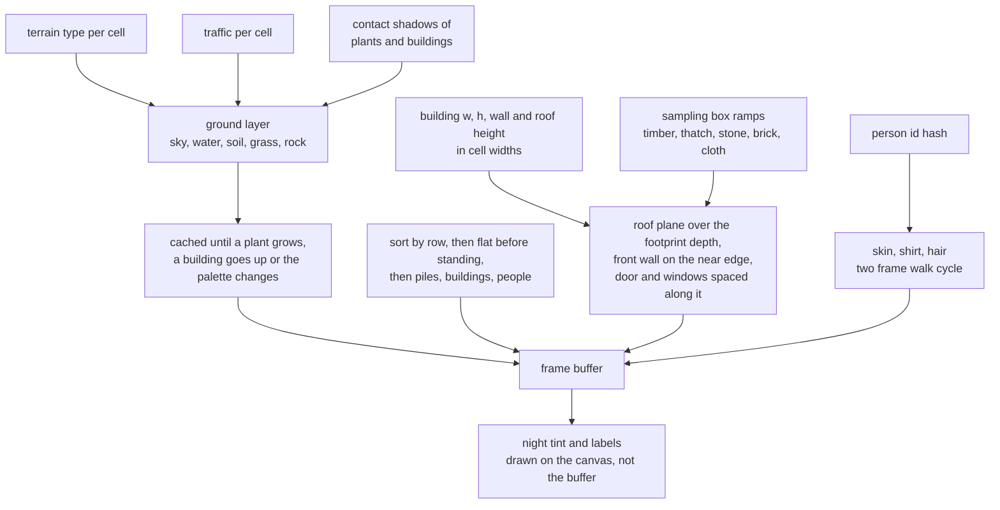
